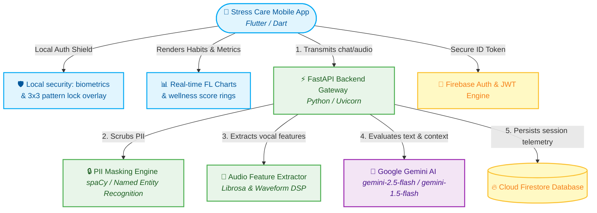

# 🌿 Stress Care — Premium AI Wellness & Health Solutions

Stress Care is a state-of-the-art, secure, and premium mobile-first application designed to help individuals track, analyze, and manage their daily stress levels, emotions, and wellness journey through custom AI-driven chat analysis, biometric privacy mechanisms, acoustic voice analysis, and real-time visualization dashboards.

---

## 🏗️ System Architecture



---

## ✨ Features Implemented & Integrated

### 1. 👻 Premium Privacy: Ghost Mode
* **Complete Offline Chatting:** Toggle Ghost Mode with a single tap in the app drawer to chat anonymously.
* **Zero Firestore Footprint:** In Ghost Mode, conversation logs, telemetry records, and transcription data are processed locally and in-memory, ensuring zero persistence on both FastAPI and Cloud Firestore.

### 2. 🛡️ Advanced Security & Biometrics
* **Custom 3x3 App Pattern Lock:** An elegant, canvas-drawn gesture lock screen overlay featuring neon teal guides, haptic vibration triggers, and hardware back-button intercept shields to prevent escapes.
* **Secure Local Authentication:** Built-in integration with Face ID and Fingerprint biometric sensors to guard app launching.
* **PII Masking Shield:** Automatical regex and NLP-driven client/backend scrubber that redacts Names, Phones, Emails, Aadhaar, PAN, Credit Cards, and passwords using `spaCy` (scrubs data *before* sending text to any external API).

### 3. 📊 Real-time AI Wellness Dashboard
* **Dynamic Streak Card:** Live daily wellness streaks and interactive session counters.
* **Custom Wellness Score Rings:** Elegant, custom-painted circular progress rings mapping Stress, Focus, Calm, and overall Wellness index (0-100%) dynamically calculated from your live Firestore database records.
* **Firestore Sync:** Instantly syncs user profiles, avatar configurations, and settings with Firestore merges (`SetOptions`).

### 4. 🧠 Dual-Emotion Processing Pipeline
* **Textual Emotion Modeling:** Real-time deep contextual sentences-level sentiment evaluation powered by the state-of-the-art **Google Gemini AI** (`gemini-2.5-flash` with direct automatic fallbacks to `gemini-1.5-flash` and local regex/keyword-aware emotion classifiers).
* **Vocal & Acoustic Feature Extraction:** Complete voice analytics processing pipelines. Audio uploads are decoded to extract wave properties like root-mean-square energy (volume/tension), pitch variation (ZCR), and spectral centroid (vocal speed).

### 5. 📷 On-Device Real-Time Face & Facial Emotion Analysis
* **Live Camera Stream Integration:** Streams real-time frames directly from the front/back camera descriptors.
* **On-Device Face Boundary Detection:** Uses `google_mlkit_face_detection` to track and draw precise face bounding boxes in real-time.
* **Jitter Reduction:** Implements an **Exponential Moving Average (EMA)** algorithm for frame boundary box smoothing, ensuring a stable visual overlay.
* **TensorFlow Lite Classification:** Feeds normalized face crops into a custom-loaded **TFLite model** (`assets/ml/emotion_model.tflite`) for lightning-fast, offline inference of user emotions (Happy, Sad, Angry, Surprised, Neutral, etc.).
* **Adaptive Frame-Skip Optimization:** Dynamically adjusts processing skip-factors based on live device CPU/GPU thread latency to prevent UI lag on older devices.
* **Wellness Workflow Binding:** Connects live facial readings directly to user session inputs to tailor context-driven emotional assistance.

### 6. 🗑️ Permanent Multi-Session Batch Deletion
* **Gmail-style Selection:** Toggle multi-select editing mode in the Session History screen. Long-press to edit and purge multiple selected chat records permanently across device caches and Cloud Firestore in a single API call.

---

## 🛠️ Tech Stack

### Frontend Mobile App
* **Framework:** Flutter (Dart)
* **Visuals & Charts:** Custom painted canvases, `fl_chart`
* **Local Security:** `local_auth` (FaceID/Fingerprint), `flutter_secure_storage`
* **On-Device ML:** `google_mlkit_face_detection`, `tflite_flutter`
* **Audio & Voice:** `speech_to_text`, `record`, `just_audio`, `audio_waveforms`
* **Cloud Integration:** Firebase Core, Firebase Auth, Cloud Firestore

### Backend Gateway API
* **Web Server:** Python, FastAPI, Uvicorn
* **Natural Language Processing:** `spaCy` (`en_core_web_sm` model), Regex engines
* **Acoustics & DSP:** `librosa`, `soundfile`, `SpeechRecognition`
* **AI & LLM Client:** `google-generativeai` (Gemini SDK)
* **Auth & Hashing:** `passlib` (Bcrypt), `python-jose` (JWT), `cryptography`

---

## 🚀 Running the Project

### 1. ⚙️ FastAPI Python Backend
1. **Navigate to the backend directory:**
   ```bash
   cd backend
   ```
2. **Create and activate a virtual environment:**
   ```bash
   python3 -m venv venv
   source venv/bin/activate
   ```
3. **Install dependencies:**
   ```bash
   pip install -r requirements.txt
   ```
4. **Configure Environment Variables:**
   Create a `.env` file inside the `backend/` directory:
   ```env
   GEMINI_API_KEY=your_google_gemini_api_key_here
   SECRET_KEY=your_jwt_signature_secret_key
   ALGORITHM=HS256
   ACCESS_TOKEN_EXPIRE_MINUTES=1440
   ```
5. **Run the local development gateway:**
   ```bash
   uvicorn main:app --reload --host 0.0.0.0 --port 8000
   ```
   *The Swagger UI documentation is available at `http://localhost:8000/docs`.*

### 2. 📱 Flutter Mobile Frontend
1. **Navigate to the frontend directory:**
   ```bash
   cd frontend_app
   ```
2. **Install Dart/Flutter packages:**
   ```bash
   flutter pub get
   ```
3. **Verify Firebase Setup:**
   Ensure the Firebase configuration matches your `google-services.json` (Android) and `GoogleService-Info.plist` (iOS) in respective project directories.
4. **Run the application on a simulator or device:**
   ```bash
   flutter run
   ```
   *To launch specifically in Chrome for debugging:*
   ```bash
   flutter run -d chrome --web-port=3000
   ```

---

## 🔒 Security & Privacy First
Stress Care utilizes end-to-end industry-standard encryption, local secure device storage (`flutter_secure_storage`), PII masking algorithms to strip sensitive phone numbers or names before AI processing, and hardware back-button intercept shields to ensure your health information remains 100% yours.

---

## ⚡ Comprehensive API Reference

### 🔐 Authentication Endpoints

#### `POST /auth/signup`
Creates a secure local database user.
* **Request Body:**
  ```json
  {
    "full_name": "John Doe",
    "email": "john.doe@example.com",
    "password": "Password123!"
  }
  ```
* **Response:**
  ```json
  {
    "message": "User created successfully",
    "user_id": "auto_generated_id",
    "token": "jwt_access_token"
  }
  ```

#### `POST /auth/signin`
Validates credentials and issues secure access JWT tokens.
* **Request Body:**
  ```json
  {
    "email": "john.doe@example.com",
    "password": "Password123!"
  }
  ```
* **Response:**
  ```json
  {
    "message": "Login successful",
    "token": "jwt_access_token"
  }
  ```

#### `POST /auth/google`
Authenticates third-party Google and Firebase tokens securely.
* **Request Body:**
  ```json
  {
    "id_token_str": "firebase_id_token_string"
  }
  ```

---

### 💬 Chat & AI Endpoints

#### `POST /chat/message`
Evaluates textual/voice sentiment, processes PII scrubbing, queries Gemini, updates daily streaks, and records transactions in Firestore.
* **Headers:** `Authorization: Bearer <token>`
* **Request Body:**
  ```json
  {
    "message": "I feel extremely burnt out today at my job.",
    "session_id": "work-anxiety-1",
    "ghost_mode": false,
    "input_type": "text"
  }
  ```
* **Response:**
  ```json
  {
    "masked_text": "I feel extremely burnt out today at my job.",
    "emotion": "fatigue",
    "stress_score": 78,
    "analysis": "User explicitly stated feeling extreme job burnout.",
    "ai_response": "I hear how heavy things feel, carrying that level of exhaustion is exhausting. Please remember it's okay to step back 💙",
    "wellness_tip": "Set a firm boundary tonight. Close your work tabs and enjoy a warm, screen-free tea.",
    "empathy_score": 92,
    "emotional_confidence": 0.95,
    "stress_confidence": 0.90,
    "warmth_score": 88
  }
  ```

#### `GET /chat/history`
Fetches conversation history associated with the current session.
* **Headers:** `Authorization: Bearer <token>`
* **Query Parameters:** `session_id` *(optional)*
* **Response:**
  ```json
  {
    "messages": [
      {
        "chat_id": "doc_id_1",
        "session_id": "default",
        "user_message": "Hello",
        "ai_response": "Hi there! How can I support you today? 💙",
        "emotion": "neutral",
        "score": 20,
        "stress_level": "low",
        "created_at": "2026-05-26T23:00:00Z"
      }
    ]
  }
  ```

#### `POST /chat/delete-sessions`
Permanently batch purges target session channels.
* **Headers:** `Authorization: Bearer <token>`
* **Request Body:**
  ```json
  {
    "session_ids": ["session_id_1", "session_id_2"]
  }
  ```

---

### 🎤 Voice & Audio Endpoints

#### `POST /audio/analyze`
Extracts acoustic physical wave properties via `librosa`, executes voice sentiment analyses, transcribes speech, and responds empathetically.
* **Headers:** `Authorization: Bearer <token>`
* **Content-Type:** `multipart/form-data`
* **Form Fields:**
  * `file`: (Binary audio upload)
  * `ghost_mode`: `true` | `false`
  * `session_id`: `voice_session_1`
* **Response:**
  ```json
  {
    "transcription": "I am feeling so anxious about this meeting",
    "masked_text": "I am feeling so anxious about this meeting",
    "emotion": "anxiety",
    "stress_score": 72,
    "stress_level": "high",
    "analysis": "Acoustic features coupled with spoken keywords highlight an intense level of stress.",
    "ai_response": "I can hear the tension in your voice. Let's take a deep breath together. You've got this.",
    "wellness_tip": "Do a quick 5-4-3-2-1 grounding exercise to calm your physical senses.",
    "audio_features": {
      "energy": 0.082,
      "pitch_variation": 12.5,
      "speech_rate": 1.45
    }
  }
  ```
