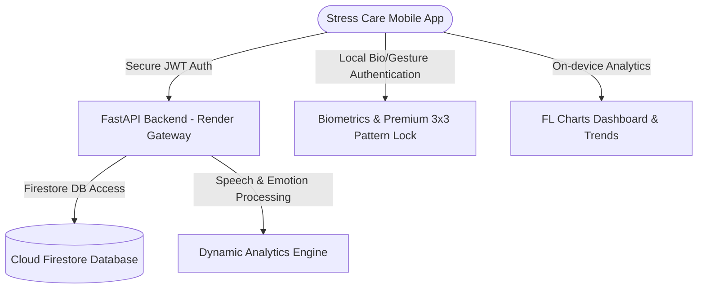

# 🌿 Stress Care — Premium AI Wellness & Health Solutions

Stress Care is a state-of-the-art, secure, and premium mobile-first application designed to help individuals track, analyze, and manage their daily stress levels, emotions, and wellness journey through custom AI-driven chat analysis, biometric privacy mechanisms, and real-time visualization dashboards.

---

## 🏗️ System Architecture



---

## ✨ Features Implemented & Integrated

### 1. 👻 Premium Privacy: Ghost Mode
- Fully anonymous chat capabilities.
- Toggle Ghost Mode with a single tap in the main drawer to chat completely offline, without writing messages or telemetry records to Firestore.

### 2. 🛡️ Advanced Security & Biometrics
- **Custom 3x3 App Pattern Lock:** An elegant, canvas-drawn gesture lock screen with neon teal guides, vibration triggers, and non-dismissible hardware intercept overlays (blocks hardware back button escapes).
- **Biometric Security:** Local authentication integration supporting Face ID and Fingerprint sensors.

### 3. 📊 Real-time AI Wellness Dashboard
- **Dynamic Stats Card:** Shows real-time dynamic sessions counter, current daily streak, and live mood emoji indicators.
- **Wellness Score Ring:** Sleek custom-painted progress indicators mapping average Stress, Focus, Calm, and Overall Wellness index (0-100%) dynamically calculated from real database messages.
- **Dynamic Profile Updates:** Instantly updates name, avatar, and phone settings across both local auth caches and Cloud Firestore using secure SetOptions merges.

### 4. 🗑️ Permanent Multi-Session Batch Deletion
- Toggle multi-select editing in the Session History screen.
- Long-press items to enter edit mode instantly.
- Select all or multiple sessions with Gmail-style checkboxes, and permanently delete selected chat history across the client and FastAPI/Firestore backend.

---

## 🛠️ Tech Stack

- **Frontend:** Flutter (Dart), Firebase Auth, Cloud Firestore, Local Authentication, Google Sign-in.
- **Backend:** Python (FastAPI), PyJWT, Firestore Admin SDK, Google AI Gemini Integration.
- **Deployment:** Render (`https://stress-care-backend.onrender.com`).

---

## 🚀 Running the Project

### 1. ⚙️ FastAPI Python Backend
1. Navigate to the backend directory:
   ```bash
   cd backend
   ```
2. Create and activate a virtual environment:
   ```bash
   python3 -m venv venv
   source venv/bin/activate
   ```
3. Install dependencies:
   ```bash
   pip install -r requirements.txt
   ```
4. Run the development server locally:
   ```bash
   uvicorn main:app --reload --host 0.0.0.0 --port 8000
   ```

### 2. 📱 Flutter Mobile Frontend
1. Navigate to the frontend directory:
   ```bash
   cd frontend_app
   ```
2. Install Dart/Flutter packages:
   ```bash
   flutter pub get
   ```
3. Run the application on your physical device or emulator:
   ```bash
   flutter run
   ```

---

## 🔒 Security & Privacy First
Stress Care utilizes end-to-end industry-standard encryption, local secure device storage (`flutter_secure_storage`), PII masking algorithms to strip sensitive phone numbers or names before AI processing, and hardware back-button intercept shields to ensure your health information remains 100% yours.
